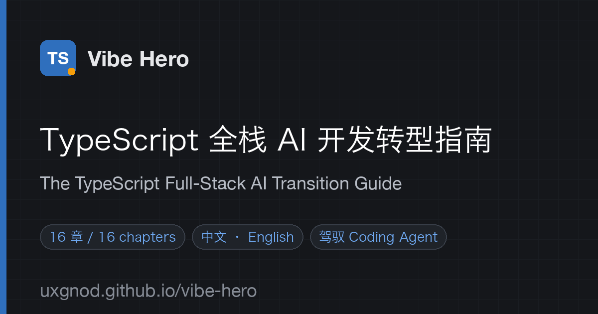

<p align="center">
  <a href="https://uxgnod.github.io/vibe-hero/"></a>
</p>

<h1 align="center">Vibe Hero · TypeScript 全栈 AI 开发转型指南</h1>

<p align="center">
  写给已经会编程、但对 TypeScript 与前端零基础的开发者 —— 建立能驾驭 Coding Agent 的心智模型、词汇和判断力。<br>
  <em>A bilingual guide for experienced developers moving into the TypeScript full-stack &amp; AI ecosystem — and learning to drive coding agents.</em>
</p>

<p align="center">
  <a href="https://uxgnod.github.io/vibe-hero/zh/index.html"><b>📖 在线阅读（中文）</b></a> ·
  <a href="https://uxgnod.github.io/vibe-hero/en/index.html"><b>📖 Read online (English)</b></a>
</p>

<p align="center">
  
  
  
  
  <a href="LICENSE"></a>
</p>

---

## 这是什么 / What is this

你写了多年 Java / Go / Python / C# / C++，现在想做 TypeScript 全栈和 AI 应用，并且让 Coding Agent（编码智能体，如 Claude Code、Codex、Cursor）替你写大部分代码。

难点往往不在语法，而在三个被悄悄替换的默认假设：

1. **代码跑在哪里**不再是固定答案：构建时、服务器、浏览器、边缘节点（Edge）……
2. **界面是声明式地“算”出来的**，不是命令式地“改”出来的：`UI = f(state)`。
3. **写代码的主体变了**：你的核心产出变成清晰的意图、准确的约束、可验证的验收标准和审查。

这套指南不教你“编程”，而是把你已有的工程直觉迁移过来，让你**懂到足以指挥 Agent、发现它的错误**。

> You already know how to program. This guide doesn't teach programming — it maps your existing engineering intuition onto the TypeScript full-stack world, so you understand enough to direct coding agents and catch their mistakes.

## 特点 / Highlights

- 🧭 **心智模型优先**：每章从一个真实困惑出发，给出“原理 / 会用 / 知道”三档学习深度。
- 🎛️ **交互式图解**：事件循环、React 重渲染、渲染模式时间线、类型收窄、流式输出、Agent 循环、部署路径。
- 🧪 **一个贯穿项目**：LinkNote，从环境搭建一路做到部署和 AI 功能。
- 🤖 **面向 Agent 时代**：专门讲 AI 应用开发、Agent 与 Harness、如何驾驭 Coding Agent。
- 🌏 **中英双语**：两种语言内容对等，随时切换。
- ⚡ **零依赖、零构建**：纯 HTML + CSS + JS，秒开，离线也能读。
- 📅 **基于 2026 年 9 月的生态**：TypeScript 7、Node 24/26、React 19、Next.js 16、TanStack Start v1、Vite 8、AI SDK 6。

## 章节 / Chapters

| # | 中文 | English |
|---|------|---------|
| 00 | [导读：一次范式转换](https://uxgnod.github.io/vibe-hero/zh/index.html) | [Orientation: A Paradigm Shift](https://uxgnod.github.io/vibe-hero/en/index.html) |
| 01 | [生态全景地图](https://uxgnod.github.io/vibe-hero/zh/landscape.html) | [The Ecosystem Map](https://uxgnod.github.io/vibe-hero/en/landscape.html) |
| 02 | [环境搭建与第一个项目](https://uxgnod.github.io/vibe-hero/zh/setup.html) | [Setup & Your First Project](https://uxgnod.github.io/vibe-hero/en/setup.html) |
| 03 | [JavaScript 运行时心智模型](https://uxgnod.github.io/vibe-hero/zh/javascript.html) | [The JavaScript Runtime Model](https://uxgnod.github.io/vibe-hero/en/javascript.html) |
| 04 | [TypeScript 类型系统](https://uxgnod.github.io/vibe-hero/zh/typescript.html) | [The TypeScript Type System](https://uxgnod.github.io/vibe-hero/en/typescript.html) |
| 05 | [Web 平台基础](https://uxgnod.github.io/vibe-hero/zh/web.html) | [Web Platform Fundamentals](https://uxgnod.github.io/vibe-hero/en/web.html) |
| 06 | [React 心智模型](https://uxgnod.github.io/vibe-hero/zh/react.html) | [Thinking in React](https://uxgnod.github.io/vibe-hero/en/react.html) |
| 07 | [渲染模式与元框架](https://uxgnod.github.io/vibe-hero/zh/rendering.html) | [Rendering & Meta-Frameworks](https://uxgnod.github.io/vibe-hero/en/rendering.html) |
| 08 | [后端、数据与端到端类型](https://uxgnod.github.io/vibe-hero/zh/backend.html) | [Backend, Data & End-to-End Types](https://uxgnod.github.io/vibe-hero/en/backend.html) |
| 09 | [部署三条路线](https://uxgnod.github.io/vibe-hero/zh/deploy.html) | [Three Deployment Paths](https://uxgnod.github.io/vibe-hero/en/deploy.html) |
| 10 | [工程化与质量保障](https://uxgnod.github.io/vibe-hero/zh/engineering.html) | [Engineering & Quality](https://uxgnod.github.io/vibe-hero/en/engineering.html) |
| 11 | [AI 应用开发](https://uxgnod.github.io/vibe-hero/zh/ai-apps.html) | [Building AI Applications](https://uxgnod.github.io/vibe-hero/en/ai-apps.html) |
| 12 | [Agent 与 Harness](https://uxgnod.github.io/vibe-hero/zh/agents.html) | [Agents & Harnesses](https://uxgnod.github.io/vibe-hero/en/agents.html) |
| 13 | [驾驭 Coding Agent](https://uxgnod.github.io/vibe-hero/zh/workflow.html) | [Driving Coding Agents](https://uxgnod.github.io/vibe-hero/en/workflow.html) |
| 14 | [系统设计与面试](https://uxgnod.github.io/vibe-hero/zh/system-design.html) | [System Design & Interviews](https://uxgnod.github.io/vibe-hero/en/system-design.html) |
| 15 | [术语表与学习计划](https://uxgnod.github.io/vibe-hero/zh/glossary.html) | [Glossary & Study Plan](https://uxgnod.github.io/vibe-hero/en/glossary.html) |

## 适合谁 / Who it's for

- ✅ 有其他语言的后端 / 系统 / 客户端经验，对 TypeScript 和前端零基础。
- ✅ 想用 Coding Agent 做全栈 AI 产品，但看不懂、判断不了 Agent 生成的代码。
- ✅ 准备 TS 全栈或 AI 应用方向的系统设计面试。
- ❌ 完全没有编程经验的初学者（建议先学一门编程语言）。

## 本地预览 / Local preview

```bash
git clone https://github.com/uxgnod/vibe-hero.git
cd vibe-hero
python3 -m http.server 8000   # 或 / or: npx serve .
```

打开 / open http://localhost:8000

## 项目结构 / Structure

```
index.html          语言选择页（记住上次选择的语言并自动跳转）
404.html            404 页面
sitemap.xml         站点地图（含中英文 hreflang）
robots.txt
llms.txt            面向 AI 搜索 / LLM 的站点索引
assets/
  style.css         全站样式（明暗主题、组件、图示配色）
  app.js            站点外壳：顶栏、侧边目录、本页目录、上下章、代码高亮、阅读进度
  widgets.js        交互演示组件
  favicon.svg / og-image.png
zh/                 简体中文，16 章
en/                 English, 16 chapters
```

- 每个页面只包含正文；导航、目录、代码块由 `assets/app.js` 在运行时生成。
- 代码示例写在 `<script type="text/plain" class="code" data-lang="ts" data-title="...">` 中，无需转义 `<` `>`。
- 章节清单在 `assets/app.js` 顶部的 `CHAPTERS` 数组中；新增章节时同时添加 `zh/xxx.html` 与 `en/xxx.html`，并更新 `sitemap.xml`、`llms.txt`。
- 阅读进度、主题、语言偏好保存在浏览器 localStorage 中，不上传任何数据。

## 部署 / Deploy

本站通过 **GitHub Pages** 从 `main` 分支根目录直接发布（根目录有 `.nojekyll`）。所有站内链接都是相对路径，放到任何静态托管（Cloudflare Pages、Vercel、Netlify、Nginx、S3 + CDN）的任意子路径下都能用：

```bash
npx wrangler pages deploy . --project-name vibe-hero
```

## 内容时效 / Freshness

内容基于 **2026 年 9 月**的生态状态。版本号会变，概念和判断方法不会轻易过时；具体 API 以官方文档为准。版本快照集中在第 01 章，更新时优先改那里。

## 许可证 / License

本作品采用 [知识共享 署名-非商业性使用-相同方式共享 4.0 国际许可协议（CC BY-NC-SA 4.0）](https://creativecommons.org/licenses/by-nc-sa/4.0/deed.zh-hans) 进行许可。你可以自由地分享、翻译和改编，但需要：**署名**（注明出处并附上链接）、**非商业使用**、**以相同许可协议分享**你的改编作品。完整条款见 [LICENSE](LICENSE)。

This work is licensed under [CC BY-NC-SA 4.0](https://creativecommons.org/licenses/by-nc-sa/4.0/). You may share and adapt it for non-commercial purposes, with attribution, under the same license. See [LICENSE](LICENSE).

## 反馈 / Feedback

发现错误、过时内容或讲不清楚的地方，欢迎提 [Issue](https://github.com/uxgnod/vibe-hero/issues)。觉得有用的话，点个 ⭐ Star 让更多转型中的开发者看到它。

Found a mistake or something outdated? [Open an issue](https://github.com/uxgnod/vibe-hero/issues). If this helped you, a ⭐ helps others find it.
